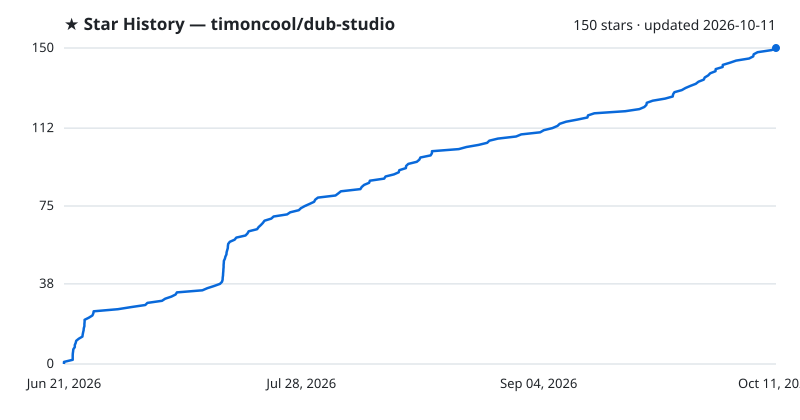

<div align="center">


# Dub Studio

**Free, offline AI video dubbing studio for Windows — re-voice any video into another language with a cloned voice, translated captions, and on‑screen‑text localization. 100% local, zero Python: one native `.exe` (Rust + C++/CUDA); every model and engine downloads with a button.**

[](LICENSE)
[](https://github.com/timoncool/dub-studio/stargazers)
[](https://github.com/timoncool/dub-studio/releases)
[](https://github.com/timoncool/dub-studio/releases)
[](https://github.com/timoncool/dub-studio/commits)

**English** · [Русский](README.ru.md) · [中文](README.zh.md) · [Español](README.es.md) · [Português](README.pt.md) · [Français](README.fr.md)

### 🌐 [Live demo & before/after video showcase →](https://timoncool.github.io/dub-studio/)


</div>

## What it is

**Dub Studio** turns any video into a dubbed version in another language — **with the speaker's own voice cloned, captions translated, and on‑screen text localized right on the frame**. Drop a clip, and a smart auto‑pass builds the first draft; then a live editor puts **every caption, voice, blur box, font and title** under your control with an instant preview.

By default everything runs **locally on your machine** — no cloud, no subscription; your footage and your voiceprint never leave your computer. And if your PC is weak (can't run the local Gemma/Higgs) or you want more speed and quality, the heavy stages (translation, vision, TTS, transcription) can **optionally** be offloaded to the cloud via **OpenRouter** — each engine picked independently (local ↔ cloud), with voices auto-cast by speaker gender (beta). The key is stored locally; everything is off by default.

It's a **fully native rewrite**. No embeddable Python, no torch, no CUDA wheels. The whole pipeline is **Rust + native C++/CUDA engines (GGUF/ONNX)**: one process, fast startup, low VRAM. Models, engines, CUDA/VC++ runtime and ffmpeg are **downloaded and installed by the app itself** on first run. **An NVIDIA GPU is what the app is built and tested for**: voice, translation and vision run on CUDA locally, and subtitles are burned into the video with NVENC. Separation, diarization and recognition can run on the CPU and the heavy stages can go to OpenRouter, but a machine without NVIDIA is not a tested setup - see *What runs where* below.

## See it in action

**[▶ Watch the before/after video showcase →](https://timoncool.github.io/dub-studio/#showcase)** — real clips dubbed end‑to‑end on a local GPU: different videos, different modes, different languages, nothing left the machine.

|  |  |  |
|:--:|:--:|:--:|
| 🎙️ **Full dub** · EN→RU | 🗣️ **Voice-over** · EN→ES | 🈶 **Full dub** · →中文, CJK on frame |
|  |  |  |
| 📝 **Subtitles** · original-lang | 🎬 **Full dub** · widescreen 16:9 | 🔤 **Transcript** · diarized |

## For AI agents

While Dub Studio is open it serves MCP at `http://127.0.0.1:8793/mcp`: an agent such as Claude Code, Claude Desktop, Cursor or Codex does everything the window does, through the same code — makes projects of video files, analyzes them, fixes the translation, timing and speakers line by line, casts the voices, styles the subtitles, adds titles and blur boxes, renders, exports the same video in more languages, writes SRT and TXT, and saves the results to a folder. Settings, **Agent (MCP)** shows whether an agent is connected and what to paste into the client.

Given this repository, an agent can set everything up and drive the studio by itself:

1. Install the studio from the [latest release](https://github.com/timoncool/dub-studio/releases/latest) and start it.
2. Connect to its MCP server:
   ```bash
   claude mcp add --transport http dub-studio http://127.0.0.1:8793/mcp
   ```
   Other clients: `{ "mcpServers": { "dub-studio": { "type": "streamable-http", "url": "http://127.0.0.1:8793/mcp" } } }`
3. Read the skill the server serves (resource `studio://skill`, prompt `studio`), the same text as [docs/mcp-skill.md](docs/mcp-skill.md) — every tool, the ground rules and step-by-step recipes — and start with the tool `studio_status`.

[llms.txt](llms.txt) says the same for tools that look for it. To keep the skill in Claude Code, save [docs/mcp-skill.md](docs/mcp-skill.md) as `~/.claude/skills/dub-studio/SKILL.md`. Only agents on this computer and the studio's own window may connect.

## Five modes, switchable on the fly

| Mode | What it does |
|------|--------------|
| 🎙️ **Dub** | Full re-voice into the target language with the **original timbre cloned** — auto-cast per speaker or pick a voice |
| 🗣️ **Voice-over** | Translated voice **over the ducked original** — the source is still audible underneath; balance is adjustable |
| 📝 **Subtitles** | Burn **original-language** captions, keep the original audio — no dubbing, no translation |
| ✨ **Funny remix** | Give a theme ("as a pirate", "as a news report") → the model **rewrites the whole script**, then re-dubs |
| 🎬 **Transcript** | Clean **diarized transcript** with per-speaker layout, karaoke play-along, one-click voice creation, `.srt`/`.txt` export |

Load a clip once and send it into any mode — right inside the editor.

## Features

- **Voice cloning** — the original timbre is cloned and speaks the new language (native [Higgs Audio v3](https://huggingface.co/bosonai) engine, GGUF). Auto-cast by speaker or bring your own voice from a pack.
- **Speaker diarization** — who speaks and when (NVIDIA **Nemotron 3 Diarization**, up to 8 voices), a distinct voice per speaker.
- **Character casting (beta)** — a character is a **face + voice** pair. The app gathers faces across the whole video, recognizes the same person and **binds them to a speaker by co-occurrence** (the one on camera in close-up gets the voice, a background listener doesn't); it auto-picks the clearest avatar frame and **saves a casting profile for the whole series** — assign voices and character descriptions once, and the **next episode applies them automatically**. A **real-faces / cartoon·anime** toggle switches the face detection accordingly.
- **Choice of ASR engine** — transcribe with **Parakeet-TDT** (GPU, default) or **Whisper** ([Purfview faster-whisper standalone](https://github.com/Purfview/whisper-standalone-win), runs on CPU) — pick the model size (tiny … large-v3-turbo) and quant (compute type) right in settings.
- **Import ready-made subtitles** — bring your own `.srt`/`.ass` as the exact transcript: text and timing come straight from the file instead of auto-recognition (speakers are still auto-assigned by diarization). Tick **“subtitles already in the target language”** and translation is skipped too — an English clip + your Russian subs → a Russian dub straight from them, no ASR and no MT.
- **Multi-language export** — the **▾** next to Export sends one video into several languages at once; each inherits all your edits (subtitle layout, styles, blur boxes, cloned voice) — only the text is re-translated and re-voiced.
- **Save & reopen projects** — autosave, a list of recent projects on the start screen, and jump back into unfinished work in one click.
- **Searchable voice & language pickers** — type part of a name to filter hundreds of voices or 100+ languages; languages also match by their name in your UI language.
- **Composable pipeline** — independent toggles at the input: audio (original / dub / voiceover / transcript) × subtitles (none / original / translated) × burn-in on/off × funny remix. Any combination — dub without subtitles, translated subtitles without dubbing, funny dub with your own voices — in batch and in the editor too.
- **On-screen text localization** — OCR detects baked-in text (**PP-OCR** ONNX), **blurs the original** and prints a localized title on top in a matched style — a feature no other tool has.
- **Translation + vision style analysis** — the transcript is translated locally with **Gemma-4 12B** (GGUF, llama.cpp); a vision pass reads the frame layout: caption style, titles, brands, text zones.
- **SOTA vocal separation** — **Mel-Band Roformer** (native BSRoformer.cpp on CUDA) splits voice from music, so the backing track is **preserved** and the clone latches onto clean speech.
- **26 caption presets** — karaoke / word-by-word / hormozi / neon and more, rendered **on your own frame** (WYSIWYG, JASSUB over the same `.ass` that ffmpeg burns).
- **Karaoke transcript** — play the video and follow along as the current line and the current **word** light up in the transcript.
- **Live editor** — edit transcript, voices, caption style, blur boxes, titles; **~0.17 s/frame preview**, every change visible instantly.
- **Smart re-gen** — export re-synthesizes and recomputes **only the segments you changed**, not the whole clip.
- **Add your own lines** — insert custom phrases into the transcript; each is voiced in the speaker's cloned voice and shown in the subtitles.
- **Batch processing** — a queue of files, all run with one setup, per-file progress.
- **Before/after compare** — original and dub side by side.
- **100+ languages** — dub into any major language (Spanish, Chinese, Japanese, Arabic, Hindi and more), with source-language auto-detect.
- **Any video format** — MP4, MOV, MKV, WEBM, AVI and more (decoded via ffmpeg).
- **One-button setup + resumable downloads + in-app auto-update** — models, engines, CUDA/VC++ runtime and ffmpeg download on first run; large models (10 GB+) **resume from where they stopped** after a dropped connection instead of restarting; the app updates itself.
- **Run each stage where you want** — separation, diarization and recognition each switch independently between **GPU and CPU**, and recognition, translation, vision and voice can be offloaded to **OpenRouter**. The *What runs where* table below lists what each stage can actually use.
- **Tune for your hardware** — every engine ships multiple quants (TTS Q8/Q6/Q4, translation Q4…Q8, ASR int8/fp32 or Whisper tiny…large-v3-turbo, separation Q8/Q5/Q4) — switch in settings; cap the **prefill batch** and **voice-reference length** to fit 8–12 GB GPUs and 32 GB RAM.
- **Fully portable** — nothing is written to your user profile; delete the folder and no trace remains.

## Screenshots

Home — five modes, a preview of the selected video, language pickers, any video format:


Transcript mode — diarized transcript with per-speaker layout, karaoke play-along and one-click voice creation from each speaker:


## Requirements

- **OS:** Windows 10 / 11 (x64); Linux x86-64 as an experimental build (see *Linux (experimental)*)
- **GPU:** NVIDIA with 8 GB of VRAM or more (presets exist for 8, 12, 16, 24 and 32 GB) and a recent driver. Local voice (Higgs Audio), translation and vision (Gemma) run on CUDA, and subtitles are burned in with NVENC. Without NVIDIA only the stages that *What runs where* marks for the CPU or the cloud can run, and that setup is not tested
- **WebView2** — preinstalled on Windows 11; on Windows 10 the installer fetches it (see *Troubleshooting* if that fails)
- **Disk:** ~15 GB for the default models, engines and runtime (fetched on first run), plus room for your projects; the alternative quantizations and Whisper models are extra

On an NVIDIA machine the only thing you install by hand is a recent **[NVIDIA driver](https://www.nvidia.com/Download/index.aspx)**. Everything else — models (Higgs Audio v3, Gemma-4 12B + vision, Parakeet-TDT, Nemotron 3 Diarization, Mel-Band Roformer), engines, CUDA runtime and ffmpeg — the app downloads with a button on first run.

## Quick start

1. **Download** the portable build from [Releases](https://github.com/timoncool/dub-studio/releases) and unzip anywhere (or install via `-setup.exe` / `.msi`).
2. **Run** `Dub Studio.exe`.
3. On the **First-run** panel press **Download all** — the app fetches models, engines and runtime (~15 GB, once). If the NVIDIA driver is missing, the button opens the download page.
4. **Drop a video**, pick a target language → the auto-pass makes the first draft. Fine-tune everything in the editor and hit **Export**.

> Everything downloads and lives **inside the app folder**. Models, caches and projects go nowhere else.

What changed and when is in [CHANGELOG.md](CHANGELOG.md), and the sparkles button at the top of the app shows it. Rules for contributors and coding agents: [AGENTS.md](AGENTS.md).

## Everything the app downloads

The first-run panel fetches all of this with one button. Behind a proxy, or where Hugging Face is blocked, set the proxy in Settings → **Network**: as in Windows, your own (HTTP, HTTPS, SOCKS5 or SOCKS4; a seller's `host:port:login:password` works as it is) or none. Model downloads, the cloud and app updates all go through it. You can also download the direct files yourself, put them where the last column says, counted from the app folder (the one that holds `models\`), and press **Import from folder**; the archive components (`.zip`, `.whl`) the app downloads itself.

A file in the listed place counts as installed when its size is exactly the listed one; every download is checked against the file's pinned SHA-256 before it is used, and a file already in place is checked the same way before it is skipped. **Import from folder** (in the first-run panel and in the model settings) finds a component's files by name and exact size in the folder you choose and links or copies them into place. Components that come as zip or wheel archives (engines, runtimes) are not imported and count as installed only when the app downloaded them itself: it keeps a record of the checked archive next to the unpacked files. Sizes and hashes are those of the app's own manifest, `crates/dub-server/src/setup.rs`, and this table is checked against it.

The Visual C++ runtime and the PP-OCR models come inside the release and are not downloaded; the NVIDIA driver is installed on its own.

<!-- downloads:start -->
| Component | Need | Files (direct links) | Size | Put it in |
|---|---|---|---|---|
| Higgs Audio v3 Q8_0 | required | [q8_0.gguf](https://huggingface.co/drbaph/Higgs-Audio-v3-Studio/resolve/c6e9db5a2062c15accc1b9bfa54d927bbdb124dc/models/higgs-q8_0/q8_0.gguf) → `models\higgs-q8_0\q8_0.gguf`<br>[config.json](https://huggingface.co/drbaph/Higgs-Audio-v3-Studio/resolve/c6e9db5a2062c15accc1b9bfa54d927bbdb124dc/models/higgs-q8_0/config.json) → `models\higgs-q8_0\config.json`<br>[chat_template.jinja](https://huggingface.co/drbaph/Higgs-Audio-v3-Studio/resolve/c6e9db5a2062c15accc1b9bfa54d927bbdb124dc/models/higgs-q8_0/chat_template.jinja) → `models\higgs-q8_0\chat_template.jinja`<br>[tokenizer.json](https://huggingface.co/drbaph/Higgs-Audio-v3-Studio/resolve/c6e9db5a2062c15accc1b9bfa54d927bbdb124dc/models/higgs-q8_0/tokenizer.json) → `models\higgs-q8_0\tokenizer.json`<br>[tokenizer_config.json](https://huggingface.co/drbaph/Higgs-Audio-v3-Studio/resolve/c6e9db5a2062c15accc1b9bfa54d927bbdb124dc/models/higgs-q8_0/tokenizer_config.json) → `models\higgs-q8_0\tokenizer_config.json`<br>[higgs_audio_v2_tokenizer_config.json](https://huggingface.co/drbaph/Higgs-Audio-v3-Studio/resolve/c6e9db5a2062c15accc1b9bfa54d927bbdb124dc/models/higgs-q8_0/higgs_audio_v2_tokenizer_config.json) → `models\higgs-q8_0\higgs_audio_v2_tokenizer_config.json` | 5.5 GB | as is, to the path after the arrow |
| audiocpp_engine.dll (Higgs engine) | required | [audiocpp_engine.dll](https://huggingface.co/drbaph/Higgs-Audio-v3-Studio/resolve/c6e9db5a2062c15accc1b9bfa54d927bbdb124dc/engines/audiocpp_engine.dll) → `models\higgs-engine\audiocpp_engine.dll` | 72 MB | as is, to the path after the arrow |
| Gemma-4 12B QAT q4_0 + vision | required | [gemma-4-12b-it-qat-q4_0.gguf](https://huggingface.co/google/gemma-4-12b-it-qat-q4_0-gguf/resolve/2b318d6ebebf093f50ca4376e858325f10703358/gemma-4-12b-it-qat-q4_0.gguf) → `models\mt\gemma-4-12b-it-qat-q4_0.gguf`<br>[mmproj-gemma-4-12b-it-qat-q4_0.gguf](https://huggingface.co/google/gemma-4-12b-it-qat-q4_0-gguf/resolve/2b318d6ebebf093f50ca4376e858325f10703358/mmproj-gemma-4-12b-it-qat-q4_0.gguf) → `models\mt\mmproj-gemma-4-12b-it-qat-q4_0.gguf` | 7.2 GB | as is, to the path after the arrow |
| Gemma-4 12B Q5_K_M + vision | optional | [gemma-4-12b-it-Q5_K_M.gguf](https://huggingface.co/unsloth/gemma-4-12b-it-GGUF/resolve/d997c805aafe035a8024f961c6e1afd6b30d79a5/gemma-4-12b-it-Q5_K_M.gguf) → `models\mt-q5_0\gemma-4-12b-it-Q5_K_M.gguf`<br>[mmproj-F16.gguf](https://huggingface.co/unsloth/gemma-4-12b-it-GGUF/resolve/d997c805aafe035a8024f961c6e1afd6b30d79a5/mmproj-F16.gguf) → `models\mt-q5_0\mmproj-F16.gguf` | 8.6 GB | as is, to the path after the arrow |
| Gemma-4 12B Q6_K + vision | optional | [gemma-4-12b-it-Q6_K.gguf](https://huggingface.co/unsloth/gemma-4-12b-it-GGUF/resolve/d997c805aafe035a8024f961c6e1afd6b30d79a5/gemma-4-12b-it-Q6_K.gguf) → `models\mt-q6_k\gemma-4-12b-it-Q6_K.gguf`<br>[mmproj-F16.gguf](https://huggingface.co/unsloth/gemma-4-12b-it-GGUF/resolve/d997c805aafe035a8024f961c6e1afd6b30d79a5/mmproj-F16.gguf) → `models\mt-q6_k\mmproj-F16.gguf` | 10.0 GB | as is, to the path after the arrow |
| Gemma-4 12B Q8_0 + vision | optional | [gemma-4-12b-it-Q8_0.gguf](https://huggingface.co/unsloth/gemma-4-12b-it-GGUF/resolve/d997c805aafe035a8024f961c6e1afd6b30d79a5/gemma-4-12b-it-Q8_0.gguf) → `models\mt-q8_0\gemma-4-12b-it-Q8_0.gguf`<br>[mmproj-F16.gguf](https://huggingface.co/unsloth/gemma-4-12b-it-GGUF/resolve/d997c805aafe035a8024f961c6e1afd6b30d79a5/mmproj-F16.gguf) → `models\mt-q8_0\mmproj-F16.gguf` | 12.8 GB | as is, to the path after the arrow |
| Parakeet-TDT 0.6B v3 int8 | required | [encoder-model.int8.onnx](https://huggingface.co/istupakov/parakeet-tdt-0.6b-v3-onnx/resolve/8f23f0c03c8761650bdb5b40aaf3e40d2c15f1ce/encoder-model.int8.onnx) → `models\tdt\encoder-model.int8.onnx`<br>[decoder_joint-model.int8.onnx](https://huggingface.co/istupakov/parakeet-tdt-0.6b-v3-onnx/resolve/8f23f0c03c8761650bdb5b40aaf3e40d2c15f1ce/decoder_joint-model.int8.onnx) → `models\tdt\decoder_joint-model.int8.onnx`<br>[nemo128.onnx](https://huggingface.co/istupakov/parakeet-tdt-0.6b-v3-onnx/resolve/8f23f0c03c8761650bdb5b40aaf3e40d2c15f1ce/nemo128.onnx) → `models\tdt\nemo128.onnx`<br>[vocab.txt](https://huggingface.co/istupakov/parakeet-tdt-0.6b-v3-onnx/resolve/8f23f0c03c8761650bdb5b40aaf3e40d2c15f1ce/vocab.txt) → `models\tdt\vocab.txt`<br>[config.json](https://huggingface.co/istupakov/parakeet-tdt-0.6b-v3-onnx/resolve/8f23f0c03c8761650bdb5b40aaf3e40d2c15f1ce/config.json) → `models\tdt\config.json` | 671 MB | as is, to the path after the arrow |
| Higgs Audio v3 Q6_K | optional | [q6_k.gguf](https://huggingface.co/drbaph/Higgs-Audio-v3-Studio/resolve/c6e9db5a2062c15accc1b9bfa54d927bbdb124dc/models/higgs-q6_k/q6_k.gguf) → `models\higgs-q6_k\q6_k.gguf`<br>[config.json](https://huggingface.co/drbaph/Higgs-Audio-v3-Studio/resolve/c6e9db5a2062c15accc1b9bfa54d927bbdb124dc/models/higgs-q6_k/config.json) → `models\higgs-q6_k\config.json`<br>[chat_template.jinja](https://huggingface.co/drbaph/Higgs-Audio-v3-Studio/resolve/c6e9db5a2062c15accc1b9bfa54d927bbdb124dc/models/higgs-q6_k/chat_template.jinja) → `models\higgs-q6_k\chat_template.jinja`<br>[tokenizer.json](https://huggingface.co/drbaph/Higgs-Audio-v3-Studio/resolve/c6e9db5a2062c15accc1b9bfa54d927bbdb124dc/models/higgs-q6_k/tokenizer.json) → `models\higgs-q6_k\tokenizer.json`<br>[tokenizer_config.json](https://huggingface.co/drbaph/Higgs-Audio-v3-Studio/resolve/c6e9db5a2062c15accc1b9bfa54d927bbdb124dc/models/higgs-q6_k/tokenizer_config.json) → `models\higgs-q6_k\tokenizer_config.json`<br>[higgs_audio_v2_tokenizer_config.json](https://huggingface.co/drbaph/Higgs-Audio-v3-Studio/resolve/c6e9db5a2062c15accc1b9bfa54d927bbdb124dc/models/higgs-q6_k/higgs_audio_v2_tokenizer_config.json) → `models\higgs-q6_k\higgs_audio_v2_tokenizer_config.json` | 5.0 GB | as is, to the path after the arrow |
| Higgs Audio v3 Q4_K_M | optional | [q4_k_m.gguf](https://huggingface.co/drbaph/Higgs-Audio-v3-Studio/resolve/c6e9db5a2062c15accc1b9bfa54d927bbdb124dc/models/higgs-q4_k_m/q4_k_m.gguf) → `models\higgs-q4_k_m\q4_k_m.gguf`<br>[config.json](https://huggingface.co/drbaph/Higgs-Audio-v3-Studio/resolve/c6e9db5a2062c15accc1b9bfa54d927bbdb124dc/models/higgs-q4_k_m/config.json) → `models\higgs-q4_k_m\config.json`<br>[chat_template.jinja](https://huggingface.co/drbaph/Higgs-Audio-v3-Studio/resolve/c6e9db5a2062c15accc1b9bfa54d927bbdb124dc/models/higgs-q4_k_m/chat_template.jinja) → `models\higgs-q4_k_m\chat_template.jinja`<br>[tokenizer.json](https://huggingface.co/drbaph/Higgs-Audio-v3-Studio/resolve/c6e9db5a2062c15accc1b9bfa54d927bbdb124dc/models/higgs-q4_k_m/tokenizer.json) → `models\higgs-q4_k_m\tokenizer.json`<br>[tokenizer_config.json](https://huggingface.co/drbaph/Higgs-Audio-v3-Studio/resolve/c6e9db5a2062c15accc1b9bfa54d927bbdb124dc/models/higgs-q4_k_m/tokenizer_config.json) → `models\higgs-q4_k_m\tokenizer_config.json`<br>[higgs_audio_v2_tokenizer_config.json](https://huggingface.co/drbaph/Higgs-Audio-v3-Studio/resolve/c6e9db5a2062c15accc1b9bfa54d927bbdb124dc/models/higgs-q4_k_m/higgs_audio_v2_tokenizer_config.json) → `models\higgs-q4_k_m\higgs_audio_v2_tokenizer_config.json` | 4.1 GB | as is, to the path after the arrow |
| Parakeet-TDT 0.6B v3 fp32 | optional | [encoder-model.onnx](https://huggingface.co/istupakov/parakeet-tdt-0.6b-v3-onnx/resolve/8f23f0c03c8761650bdb5b40aaf3e40d2c15f1ce/encoder-model.onnx) → `models\tdt-fp32\encoder-model.onnx`<br>[encoder-model.onnx.data](https://huggingface.co/istupakov/parakeet-tdt-0.6b-v3-onnx/resolve/8f23f0c03c8761650bdb5b40aaf3e40d2c15f1ce/encoder-model.onnx.data) → `models\tdt-fp32\encoder-model.onnx.data`<br>[decoder_joint-model.onnx](https://huggingface.co/istupakov/parakeet-tdt-0.6b-v3-onnx/resolve/8f23f0c03c8761650bdb5b40aaf3e40d2c15f1ce/decoder_joint-model.onnx) → `models\tdt-fp32\decoder_joint-model.onnx`<br>[nemo128.onnx](https://huggingface.co/istupakov/parakeet-tdt-0.6b-v3-onnx/resolve/8f23f0c03c8761650bdb5b40aaf3e40d2c15f1ce/nemo128.onnx) → `models\tdt-fp32\nemo128.onnx`<br>[vocab.txt](https://huggingface.co/istupakov/parakeet-tdt-0.6b-v3-onnx/resolve/8f23f0c03c8761650bdb5b40aaf3e40d2c15f1ce/vocab.txt) → `models\tdt-fp32\vocab.txt`<br>[config.json](https://huggingface.co/istupakov/parakeet-tdt-0.6b-v3-onnx/resolve/8f23f0c03c8761650bdb5b40aaf3e40d2c15f1ce/config.json) → `models\tdt-fp32\config.json` | 2.5 GB | as is, to the path after the arrow |
| Parakeet Ultra 0.6B fp32 (Moondream) | optional | [encoder-model.onnx](https://huggingface.co/altunenes/parakeet-rs/resolve/4d2a8bc71f5c896ec40faa59732e6716295edaf2/parakeet-ultra/encoder-model.onnx) → `models\tdt-ultra\encoder-model.onnx`<br>[encoder-model.onnx.data](https://huggingface.co/altunenes/parakeet-rs/resolve/4d2a8bc71f5c896ec40faa59732e6716295edaf2/parakeet-ultra/encoder-model.onnx.data) → `models\tdt-ultra\encoder-model.onnx.data`<br>[decoder_joint-model.onnx](https://huggingface.co/altunenes/parakeet-rs/resolve/4d2a8bc71f5c896ec40faa59732e6716295edaf2/parakeet-ultra/decoder_joint-model.onnx) → `models\tdt-ultra\decoder_joint-model.onnx`<br>[vocab.txt](https://huggingface.co/altunenes/parakeet-rs/resolve/4d2a8bc71f5c896ec40faa59732e6716295edaf2/parakeet-ultra/vocab.txt) → `models\tdt-ultra\vocab.txt`<br>[nemo128.onnx](https://huggingface.co/altunenes/parakeet-rs/resolve/4d2a8bc71f5c896ec40faa59732e6716295edaf2/tdt/nemo128.onnx) → `models\tdt-ultra\nemo128.onnx`<br>[config.json](https://huggingface.co/istupakov/parakeet-tdt-0.6b-v3-onnx/resolve/8f23f0c03c8761650bdb5b40aaf3e40d2c15f1ce/config.json) → `models\tdt-ultra\config.json` | 2.6 GB | as is, to the path after the arrow |
| Parakeet Ultra 0.6B int8 (Moondream) | optional | [encoder-model.int8.onnx](https://huggingface.co/Masterx/parakeet-tdt-0.6b-ultra-onnx/resolve/99b09f030a5a6efeaa13cf2cf54592100ce2c3f1/encoder-model.int8.onnx) → `models\tdt-ultra-int8\encoder-model.int8.onnx`<br>[decoder_joint-model.int8.onnx](https://huggingface.co/Masterx/parakeet-tdt-0.6b-ultra-onnx/resolve/99b09f030a5a6efeaa13cf2cf54592100ce2c3f1/decoder_joint-model.int8.onnx) → `models\tdt-ultra-int8\decoder_joint-model.int8.onnx`<br>[vocab.txt](https://huggingface.co/Masterx/parakeet-tdt-0.6b-ultra-onnx/resolve/99b09f030a5a6efeaa13cf2cf54592100ce2c3f1/vocab.txt) → `models\tdt-ultra-int8\vocab.txt`<br>[nemo128.onnx](https://huggingface.co/istupakov/parakeet-tdt-0.6b-v3-onnx/resolve/8f23f0c03c8761650bdb5b40aaf3e40d2c15f1ce/nemo128.onnx) → `models\tdt-ultra-int8\nemo128.onnx`<br>[config.json](https://huggingface.co/Masterx/parakeet-tdt-0.6b-ultra-onnx/resolve/99b09f030a5a6efeaa13cf2cf54592100ce2c3f1/config.json) → `models\tdt-ultra-int8\config.json` | 0.7 GB | as is, to the path after the arrow |
| Whisper-Faster (faster-whisper standalone) | optional | [Whisper-Faster_r192.3_windows.zip](https://github.com/Purfview/whisper-standalone-win/releases/download/faster-whisper/Whisper-Faster_r192.3_windows.zip) | 88 MB | unzip the files, without subfolders, into `tools\whisper\` |
| Whisper CUDA (cuBLAS 11, cuDNN 8) | optional | [libcublas-windows-x86_64-11.11.3.6-archive.zip](https://developer.download.nvidia.com/compute/cuda/redist/libcublas/windows-x86_64/libcublas-windows-x86_64-11.11.3.6-archive.zip)<br>[cudnn-windows-x86_64-8.9.7.29_cuda11-archive.zip](https://developer.download.nvidia.com/compute/cudnn/redist/cudnn/windows-x86_64/cudnn-windows-x86_64-8.9.7.29_cuda11-archive.zip) | 1.1 GB | take every .dll of the archive into `tools\whisper\` |
| Whisper tiny | optional | [model.bin](https://huggingface.co/Systran/faster-whisper-tiny/resolve/d90ca5fe260221311c53c58e660288d3deb8d356/model.bin) → `models\whisper\faster-whisper-tiny\model.bin`<br>[config.json](https://huggingface.co/Systran/faster-whisper-tiny/resolve/d90ca5fe260221311c53c58e660288d3deb8d356/config.json) → `models\whisper\faster-whisper-tiny\config.json`<br>[tokenizer.json](https://huggingface.co/Systran/faster-whisper-tiny/resolve/d90ca5fe260221311c53c58e660288d3deb8d356/tokenizer.json) → `models\whisper\faster-whisper-tiny\tokenizer.json`<br>[vocabulary.txt](https://huggingface.co/Systran/faster-whisper-tiny/resolve/d90ca5fe260221311c53c58e660288d3deb8d356/vocabulary.txt) → `models\whisper\faster-whisper-tiny\vocabulary.txt` | 78 MB | as is, to the path after the arrow |
| Whisper base | optional | [model.bin](https://huggingface.co/Systran/faster-whisper-base/resolve/ebe41f70d5b6dfa9166e2c581c45c9c0cfc57b66/model.bin) → `models\whisper\faster-whisper-base\model.bin`<br>[config.json](https://huggingface.co/Systran/faster-whisper-base/resolve/ebe41f70d5b6dfa9166e2c581c45c9c0cfc57b66/config.json) → `models\whisper\faster-whisper-base\config.json`<br>[tokenizer.json](https://huggingface.co/Systran/faster-whisper-base/resolve/ebe41f70d5b6dfa9166e2c581c45c9c0cfc57b66/tokenizer.json) → `models\whisper\faster-whisper-base\tokenizer.json`<br>[vocabulary.txt](https://huggingface.co/Systran/faster-whisper-base/resolve/ebe41f70d5b6dfa9166e2c581c45c9c0cfc57b66/vocabulary.txt) → `models\whisper\faster-whisper-base\vocabulary.txt` | 148 MB | as is, to the path after the arrow |
| Whisper small | optional | [model.bin](https://huggingface.co/Systran/faster-whisper-small/resolve/536b0662742c02347bc0e980a01041f333bce120/model.bin) → `models\whisper\faster-whisper-small\model.bin`<br>[config.json](https://huggingface.co/Systran/faster-whisper-small/resolve/536b0662742c02347bc0e980a01041f333bce120/config.json) → `models\whisper\faster-whisper-small\config.json`<br>[tokenizer.json](https://huggingface.co/Systran/faster-whisper-small/resolve/536b0662742c02347bc0e980a01041f333bce120/tokenizer.json) → `models\whisper\faster-whisper-small\tokenizer.json`<br>[vocabulary.txt](https://huggingface.co/Systran/faster-whisper-small/resolve/536b0662742c02347bc0e980a01041f333bce120/vocabulary.txt) → `models\whisper\faster-whisper-small\vocabulary.txt` | 486 MB | as is, to the path after the arrow |
| Whisper medium | optional | [model.bin](https://huggingface.co/Systran/faster-whisper-medium/resolve/08e178d48790749d25932bbc082711ddcfdfbc4f/model.bin) → `models\whisper\faster-whisper-medium\model.bin`<br>[config.json](https://huggingface.co/Systran/faster-whisper-medium/resolve/08e178d48790749d25932bbc082711ddcfdfbc4f/config.json) → `models\whisper\faster-whisper-medium\config.json`<br>[tokenizer.json](https://huggingface.co/Systran/faster-whisper-medium/resolve/08e178d48790749d25932bbc082711ddcfdfbc4f/tokenizer.json) → `models\whisper\faster-whisper-medium\tokenizer.json`<br>[vocabulary.txt](https://huggingface.co/Systran/faster-whisper-medium/resolve/08e178d48790749d25932bbc082711ddcfdfbc4f/vocabulary.txt) → `models\whisper\faster-whisper-medium\vocabulary.txt` | 1.5 GB | as is, to the path after the arrow |
| Whisper large-v3 | optional | [model.bin](https://huggingface.co/Systran/faster-whisper-large-v3/resolve/edaa852ec7e145841d8ffdb056a99866b5f0a478/model.bin) → `models\whisper\faster-whisper-large-v3\model.bin`<br>[config.json](https://huggingface.co/Systran/faster-whisper-large-v3/resolve/edaa852ec7e145841d8ffdb056a99866b5f0a478/config.json) → `models\whisper\faster-whisper-large-v3\config.json`<br>[preprocessor_config.json](https://huggingface.co/Systran/faster-whisper-large-v3/resolve/edaa852ec7e145841d8ffdb056a99866b5f0a478/preprocessor_config.json) → `models\whisper\faster-whisper-large-v3\preprocessor_config.json`<br>[tokenizer.json](https://huggingface.co/Systran/faster-whisper-large-v3/resolve/edaa852ec7e145841d8ffdb056a99866b5f0a478/tokenizer.json) → `models\whisper\faster-whisper-large-v3\tokenizer.json`<br>[vocabulary.json](https://huggingface.co/Systran/faster-whisper-large-v3/resolve/edaa852ec7e145841d8ffdb056a99866b5f0a478/vocabulary.json) → `models\whisper\faster-whisper-large-v3\vocabulary.json` | 3.1 GB | as is, to the path after the arrow |
| Whisper large-v3-turbo | optional | [model.bin](https://huggingface.co/deepdml/faster-whisper-large-v3-turbo-ct2/resolve/4df90f75321148c3a29a9e2351b7ddf8f5b115a8/model.bin) → `models\whisper\faster-whisper-large-v3-turbo\model.bin`<br>[config.json](https://huggingface.co/deepdml/faster-whisper-large-v3-turbo-ct2/resolve/4df90f75321148c3a29a9e2351b7ddf8f5b115a8/config.json) → `models\whisper\faster-whisper-large-v3-turbo\config.json`<br>[preprocessor_config.json](https://huggingface.co/deepdml/faster-whisper-large-v3-turbo-ct2/resolve/4df90f75321148c3a29a9e2351b7ddf8f5b115a8/preprocessor_config.json) → `models\whisper\faster-whisper-large-v3-turbo\preprocessor_config.json`<br>[tokenizer.json](https://huggingface.co/deepdml/faster-whisper-large-v3-turbo-ct2/resolve/4df90f75321148c3a29a9e2351b7ddf8f5b115a8/tokenizer.json) → `models\whisper\faster-whisper-large-v3-turbo\tokenizer.json`<br>[vocabulary.json](https://huggingface.co/deepdml/faster-whisper-large-v3-turbo-ct2/resolve/4df90f75321148c3a29a9e2351b7ddf8f5b115a8/vocabulary.json) → `models\whisper\faster-whisper-large-v3-turbo\vocabulary.json` | 1.6 GB | as is, to the path after the arrow |
| Nemotron 3 Diarization | recommended | [nemotron3_diar_v3.onnx](https://huggingface.co/altunenes/parakeet-rs/resolve/4d2a8bc71f5c896ec40faa59732e6716295edaf2/nemotron-3-diarization/nemotron3_diar_v3.onnx) → `models\nemotron-diar\nemotron3_diar_v3.onnx`<br>[LICENSE](https://huggingface.co/altunenes/parakeet-rs/resolve/4d2a8bc71f5c896ec40faa59732e6716295edaf2/nemotron-3-diarization/LICENSE) → `models\nemotron-diar\LICENSE` | 401 MB | as is, to the path after the arrow |
| Mel-Band Roformer voc_fv6 Q8_0 | recommended | [voc_fv6-Q8_0.gguf](https://huggingface.co/chenmozhijin/BSRoformer-GGUF/resolve/df802a6773d25ba6ef785ff619daa3e510503168/GaboxR67/MelBandRoformers/melbandroformers/vocals/voc_fv6-Q8_0.gguf) → `models\bsroformer\voc_fv6-Q8_0.gguf` | 252 MB | as is, to the path after the arrow |
| Mel-Band Roformer voc_fv6 Q5_0 | optional | [voc_fv6-Q5_0.gguf](https://huggingface.co/chenmozhijin/BSRoformer-GGUF/resolve/df802a6773d25ba6ef785ff619daa3e510503168/GaboxR67/MelBandRoformers/melbandroformers/vocals/voc_fv6-Q5_0.gguf) → `models\bsroformer\voc_fv6-Q5_0.gguf` | 167 MB | as is, to the path after the arrow |
| Mel-Band Roformer voc_fv6 Q4_0 | optional | [voc_fv6-Q4_0.gguf](https://huggingface.co/chenmozhijin/BSRoformer-GGUF/resolve/df802a6773d25ba6ef785ff619daa3e510503168/GaboxR67/MelBandRoformers/melbandroformers/vocals/voc_fv6-Q4_0.gguf) → `models\bsroformer\voc_fv6-Q4_0.gguf` | 139 MB | as is, to the path after the arrow |
| Casting models (faces and voice) | recommended | [model.onnx](https://huggingface.co/immich-app/buffalo_l/resolve/d09715916a0778919a770c343533641e250b8699/detection/model.onnx) → `models\faces\det_10g.onnx`<br>[LVFace-L_Glint360K.onnx](https://huggingface.co/bytedance-research/LVFace/resolve/b12702ab1f5c721748e054a66dc90e1edd1f0724/LVFace-L_Glint360K/LVFace-L_Glint360K.onnx) → `models\faces\LVFace-L_Glint360K.onnx`<br>[model_feat.onnx](https://huggingface.co/deepghs/ccip_onnx/resolve/eb2acdd29af1703388d3d0c04221add322bc9110/ccip-caformer-24-randaug-pruned/model_feat.onnx) → `models\faces\ccip\model_feat.onnx`<br>[model.onnx](https://huggingface.co/deepghs/anime_face_detection/resolve/784dc4c0bb692351ddcdbe6131a050b17d3025d5/face_detect_v1.4_s/model.onnx) → `models\faces\anime_face\model.onnx`<br>[xseg_1.onnx](https://huggingface.co/facefusion/models-3.1.0/resolve/c9e3a503d8e84e91c5cd89ee2d510fe5e793e570/xseg_1.onnx) → `models\faces\occluder\xseg_1.onnx`<br>[voxceleb_resnet34_LM.onnx](https://huggingface.co/Wespeaker/wespeaker-voxceleb-resnet34-LM/resolve/f0c48c298fd835726c27956a5d617bad7115627e/voxceleb_resnet34_LM.onnx) → `models\faces\wespeaker\voxceleb_resnet34_LM.onnx` | 1.3 GB | as is, to the path after the arrow |
| BSRoformer.cpp (CUDA) | recommended | [BSRoformer-windows-cuda-13.1.0.zip](https://github.com/chenmozhijin/BSRoformer.cpp/releases/download/v0.1.0/BSRoformer-windows-cuda-13.1.0.zip) | 165 MB | unzip the files, without subfolders, into `tools\bsroformer\` |
| BSRoformer.cpp (CPU) | optional | [BSRoformer-windows-x64-msvc.zip](https://github.com/chenmozhijin/BSRoformer.cpp/releases/download/v0.1.0/BSRoformer-windows-x64-msvc.zip) | 671 KB | unzip the files, without subfolders, into `tools\bsroformer-cpu\` |
| llama.cpp server (CUDA) | required | [llama-b11146-bin-win-cuda-13.4-x64.zip](https://github.com/ggml-org/llama.cpp/releases/download/b11146/llama-b11146-bin-win-cuda-13.4-x64.zip) | 150 MB | unzip the files, without subfolders, into `tools\llama\` |
| ONNX Runtime | required | [onnxruntime-win-x64-1.28.2.zip](https://github.com/microsoft/onnxruntime/releases/download/v1.28.2/onnxruntime-win-x64-1.28.2.zip) | 79 MB | unzip with its folder tree into `models\runtime\` |
| ONNX Runtime GPU (CUDA) | recommended | [onnxruntime-win-x64-gpu_cuda13-1.28.2.zip](https://github.com/microsoft/onnxruntime/releases/download/v1.28.2/onnxruntime-win-x64-gpu_cuda13-1.28.2.zip) | 366 MB | unzip with its folder tree into `models\runtime\` |
| FFmpeg (static build) | required | [ffmpeg-N-126342-gf88b741dbf-win64-gpl.zip](https://github.com/BtbN/FFmpeg-Builds/releases/download/autobuild-2026-08-31-13-27/ffmpeg-N-126342-gf88b741dbf-win64-gpl.zip) | 171 MB | take ffmpeg.exe and ffprobe.exe from the archive into `tools\ffmpeg\` |
| yt-dlp + deno | optional | [yt-dlp.exe](https://github.com/yt-dlp/yt-dlp/releases/download/2026.08.19/yt-dlp.exe) → `tools\yt-dlp\yt-dlp.exe`<br>[deno-x86_64-pc-windows-msvc.zip](https://github.com/denoland/deno/releases/download/v2.9.7/deno-x86_64-pc-windows-msvc.zip) | 60 MB | as is, to the path after the arrow<br>unzip the files, without subfolders, into `tools\yt-dlp\` |
| CUDA runtime (cudart, cuBLAS, cuFFT) | required | [nvidia_cuda_runtime-13.4.92-py3-none-win_amd64.whl](https://files.pythonhosted.org/packages/86/00/d5436004268f049214193659ebc36550b5ef3925c3d13b4cc980e13be6f5/nvidia_cuda_runtime-13.4.92-py3-none-win_amd64.whl)<br>[nvidia_cublas-13.8.0.4-py3-none-win_amd64.whl](https://files.pythonhosted.org/packages/a3/df/f1246959833e2c437db8be3e5b477f66b87f8817821ed40de6c7561c9a36/nvidia_cublas-13.8.0.4-py3-none-win_amd64.whl)<br>[libcufft-windows-x86_64-12.4.0.43-archive.zip](https://developer.download.nvidia.com/compute/cuda/redist/libcufft/windows-x86_64/libcufft-windows-x86_64-12.4.0.43-archive.zip) | 586 MB | take every .dll of the archive into `models\higgs-engine\` |
| cuDNN 9 | recommended | [nvidia_cudnn_cu13-9.27.0.42-py3-none-win_amd64.whl](https://files.pythonhosted.org/packages/87/6a/e55ff0ac26a5c6e2b21f41c9d04ad096b4ed6da593fba7e25845c61b0532/nvidia_cudnn_cu13-9.27.0.42-py3-none-win_amd64.whl) | 436 MB | take every .dll of the archive into `models\higgs-engine\` |
<!-- downloads:end -->

## What runs where

Every stage has its own switch for the device. *Yes* means the code has that path; the table says nothing about speed or test coverage, and the CPU paths are slower. The cloud paths need an OpenRouter key (Settings) and are off by default.

| Stage | Engine | NVIDIA GPU | CPU | OpenRouter (cloud) |
|---|---|---|---|---|
| Separation | Mel-Band Roformer (BSRoformer.cpp) | yes (CUDA build) | yes (separate CPU build, slower) | no |
| Diarization | Nemotron 3 Diarization | yes (ONNX Runtime CUDA) | yes | no |
| Speech recognition | Parakeet-TDT or Whisper-Faster | yes | yes | yes |
| Translation and vision | Gemma-4 12B (llama.cpp) | yes (CUDA build) | no | yes |
| Voice and cloning | Higgs Audio v3 | yes (CUDA) | no | yes |
| On-screen text | PP-OCR | no | yes | no |
| Casting (faces and voices) | SCRFD, LVFace, anime_face, CCIP, WeSpeaker | no | yes | no |
| Subtitles burned into the video | ffmpeg | yes (NVENC) | no | no |

With no NVIDIA, voice, translation, vision and recognition can go to the cloud and separation and diarization to the CPU, but the burn-in has no CPU path, so such a machine is not a tested setup.

## Troubleshooting

**The installer stops on WebView2.** The window of the app runs on Microsoft Edge WebView2, and the installer fetches it when Windows lacks it. On a blocked or unsteady connection, or on Windows 10 builds that refuse Microsoft's small bootstrapper (error 0x80040902), that fetch fails. Install WebView2 from Microsoft's standalone installer, [Evergreen Standalone x64](https://go.microsoft.com/fwlink/p/?LinkId=2124701), then run the installer of Dub Studio again.

**Downloads stall or fail.** Large files resume from where they stopped, so press the button again. If Hugging Face or GitHub is blocked for you, set a proxy in Settings → **Network**, or download the direct files by hand from the table, put them where the last column says and press **Import from folder**.

**Export stops with `Unrecognized option 'filter_complex_script'`.** That was a failure on ffmpeg 8 and newer, fixed in 3.1.1: update the app. The app uses the ffmpeg in `tools\ffmpeg`, and when there is none it accepts one that is on the `PATH`. When you report an export error, attach the complete ffmpeg output from the log.

**Recognition fails with `MemcpyToHost` or `Failed to allocate memory`.** The GPU ran out of memory in the speech recognition of a long or large file (issue #4). Close other programs that use the GPU, or set the recognition stage to **CPU** in the settings, and run it again.

**`CUDA execution provider is not enabled`, or everything lands on one speaker.** The GPU libraries are missing or too old for the driver. Install the current NVIDIA driver, press the download button for the CUDA runtime, cuDNN and ONNX Runtime GPU in the model settings, or switch the stage to CPU.

## How it works

`analyze()` is a fixed first pass: separation → ASR with word timings → diarization → context translation + vision (caption style / titles / brands) → OCR (layout / blur boxes). The result is an editable **Project** document. Each edit is a patch on that Project with a ~0.17 s/frame preview; export re-runs **only the dirtied stages**.

**Stack:** a native **Tauri 2 (Rust)** shell runs `dub-server` (axum) inside the same process on `127.0.0.1:8793` (the MCP endpoint for agents is `/mcp` on the same port) and opens a window onto the SPA — React 19 + Vite + Tailwind + react-konva over JASSUB. Engines: Parakeet-TDT or Whisper (ASR) · Nemotron 3 Diarization (diarization) · Gemma-4-12B GGUF (translation + vision, llama.cpp) · Higgs Audio v3 (TTS) · Mel-Band Roformer (separation, BSRoformer.cpp) · PP-OCR (ONNX) · ffmpeg/NVENC. **Not a single Python process at runtime.**

### Build from source

```bash
git clone https://github.com/timoncool/dub-studio.git
cd dub-studio

cd frontend && npm install && npm run build && cd ..   # 1) SPA
cargo build --release -p dub-server                     # 2) native server (axum)
cd desktop && npm install && npx tauri build            # 3) desktop shell (Tauri)
```

Needs Node 20+, Rust (MSVC toolchain) and WebView2. Native engines (`audiocpp_engine.dll`, llama.cpp, BSRoformer.cpp, ONNX Runtime) don't need rebuilding — the app downloads prebuilt binaries.

### Linux (experimental)

The .deb and the AppImage for Linux x86-64 are **experimental**. They come from the same code with the Linux builds of the same engines (llama.cpp, ONNX Runtime, BSRoformer.cpp, ffmpeg, the Higgs engine for Linux, yt-dlp, faster-whisper), but the author works on Windows and has not run them on a real Linux desktop. **If you live on Linux, it would be great if you polished them and sent the fixes back as a pull request.**

- Local voice needs an NVIDIA RTX 30 or newer: the Higgs engine for Linux is built for sm 86, 89 and 120 only. The cloud voices work on any machine.
- The NVIDIA driver (580 or newer), `libgomp1` and `libssl3` come from the system; models, engines and CUDA libraries the app downloads on first run into `~/.local/share/dub-studio` (`$XDG_DATA_HOME`).
- Built by hand: the `Linux build (experimental)` workflow (`.github/workflows/release-linux.yml`) or `scripts/build-release-linux.sh <folder with models/ocr>`.

## More portable AI apps

| Project | What it is |
|--------|----------|
| [Higgs Ultimate](https://github.com/timoncool/Higgs-Ultimate) | Native speech synthesis & voice cloning (Higgs Audio v3) |
| [ACE-Step Studio](https://github.com/timoncool/ACE-Step-Studio) | AI music studio — songs, vocals, covers, clips |
| [YuE2 Studio](https://github.com/timoncool/YuE2-Studio) | AI song generator with an editable score — a native Windows app, no Python |
| [MiniMax Music3 Studio](https://github.com/timoncool/MiniMax-Music3-Studio) | Native local/cloud AI music studio powered by MiniMax Music 3 |
| [Foundation Music Lab](https://github.com/timoncool/Foundation-Music-Lab) | Music generation + timeline editor |
| [Qwen3-TTS](https://github.com/timoncool/Qwen3-TTS_portable_rus) | Portable TTS with voice cloning |
| [VibeVoice ASR](https://github.com/timoncool/VibeVoice_ASR_portable_ru) | Portable speech recognition |
| [SuperCaption Qwen3-VL](https://github.com/timoncool/SuperCaption_Qwen3-VL) | Portable image captioning |

## Contributing & forks

**Collaborators are very welcome.** I'd be genuinely happy to see Dub Studio forked to other platforms and GPUs — the architecture is capable of it, I simply don't have the bandwidth to do the ports myself. If you want it on **AMD / Intel GPUs, macOS or Linux**, fork it and go — PRs welcome. Linux already has an experimental build (see *Linux (experimental)*): polishing it is the most welcome help.

**Extra localizations** are just as welcome: the app and landing ship in 6 languages today — translate the locale files (`frontend/src/locales/` and the dict in `docs/index.html`) and open a PR to add yours.

## Authors

- **Nerual Dreming** — [Telegram](https://t.me/nerual_dreming) | [neuro-cartel.com](https://neuro-cartel.com) | founder of [ArtGeneration.me](https://artgeneration.me)
- **Neuro-Soft** — [Telegram](https://t.me/neuroport) | portable AI apps

## Credits

- **[Boson AI](https://huggingface.co/bosonai)** — the Higgs Audio v3 model, and **[drbaph / Higgs-Audio-v3-Studio](https://huggingface.co/drbaph/Higgs-Audio-v3-Studio)** — the GGUF quants and the native `audiocpp_engine.dll`.
- **[NVIDIA Parakeet](https://huggingface.co/nvidia/parakeet-tdt-0.6b-v3)** (CC-BY-4.0) — ASR; ONNX weights from [istupakov/parakeet-tdt-0.6b-v3-onnx](https://huggingface.co/istupakov/parakeet-tdt-0.6b-v3-onnx), runtime [altunenes/parakeet-rs](https://github.com/altunenes/parakeet-rs).
- **[Parakeet Ultra](https://huggingface.co/moondream/parakeet-ultra)** by **[Moondream](https://huggingface.co/moondream)**, based on parakeet-tdt-0.6b-v3 by NVIDIA (CC-BY-4.0) — optional fine-tuned ASR with fewer recognition errors; ONNX export from [altunenes/parakeet-rs](https://huggingface.co/altunenes/parakeet-rs). int8: [Masterx/parakeet-tdt-0.6b-ultra-onnx](https://huggingface.co/Masterx/parakeet-tdt-0.6b-ultra-onnx).
- **[NVIDIA Nemotron 3 Diarization](https://huggingface.co/nvidia/Nemotron-3-Diarization)** (Streaming Sortformer v3, [OpenMDW-1.1](https://openmdw.ai/license/1-1/)) — speaker diarization, up to 8 speakers; ONNX export from [altunenes/parakeet-rs](https://huggingface.co/altunenes/parakeet-rs).
- **[Google Gemma](https://huggingface.co/google/gemma-4-12b-it-qat-q4_0-gguf)** — Gemma-4 12B (translation and vision), the quants of [unsloth](https://huggingface.co/unsloth/gemma-4-12b-it-GGUF), and [llama.cpp](https://github.com/ggml-org/llama.cpp) that runs them.
- **[chenmozhijin / BSRoformer.cpp](https://github.com/chenmozhijin/BSRoformer.cpp)** and **[GaboxR67](https://huggingface.co/GaboxR67)** — the native separation engine with its GGUF models, and the Mel-Band Roformer checkpoint.
- **[Systran / faster-whisper](https://github.com/SYSTRAN/faster-whisper)**, **[deepdml](https://huggingface.co/deepdml)** and **[Purfview](https://github.com/Purfview/whisper-standalone-win)** — the Whisper models in CTranslate2 format and the standalone build that runs them.
- **[InsightFace](https://github.com/deepinsight/insightface)** (via [immich-app/buffalo_l](https://huggingface.co/immich-app/buffalo_l)), **[ByteDance LVFace](https://huggingface.co/bytedance-research/LVFace)**, **[deepghs](https://huggingface.co/deepghs)** (CCIP, anime face detection), **[FaceFusion](https://huggingface.co/facefusion/models-3.1.0)** and **[WeSpeaker](https://huggingface.co/Wespeaker/wespeaker-voxceleb-resnet34-LM)** — the face and voice models of character casting.
- **[PaddleOCR](https://github.com/PaddlePaddle/PaddleOCR)** — PP-OCR, the on-screen text detection and recognition models.
- **[ONNX Runtime](https://github.com/microsoft/onnxruntime)**, **[FFmpeg](https://ffmpeg.org)** with the [BtbN builds](https://github.com/BtbN/FFmpeg-Builds), **[JASSUB](https://github.com/ThaUnknown/jassub)**, **[Tauri](https://tauri.app)** and **[ort](https://github.com/pykeio/ort)**.
- **NVIDIA CUDA runtime, cuBLAS, cuFFT and cuDNN** — the libraries the GPU paths run on.
- **Serega (SilentBob)** — release 3.1.0: multi-take, emotional reference, timing and the subtitle editor. **[@nevoin](https://github.com/nevoin)** — the detailed log of [#1](https://github.com/timoncool/dub-studio/issues/1) behind the ffmpeg 8 fix. **[LongNT2011](https://github.com/LongNT2011)** — [PR #1](https://github.com/LongNT2011/dub-studio/pull/1) in his fork, a fix for hard-coded Russian text in the English interface that inspired the i18n work.

## Support the author

I build open-source software and do AI research — most of what I make is freely available. Donations let me build and research more.

**[All the ways to support](DONATE.md)** | **[dalink.to/nerual_dreming](https://dalink.to/nerual_dreming)** | **[boosty.to/neuro_art](https://boosty.to/neuro_art)**

- **BTC:** `1E7dHL22RpyhJGVpcvKdbyZgksSYkYeEBC`
- **ETH (ERC20):** `0xb5db65adf478983186d4897ba92fe2c25c594a0c`
- **USDT (TRC20):** `TQST9Lp2TjK6FiVkn4fwfGUee7NmkxEE7C`

## Star history

<a href="https://github.com/timoncool/dub-studio/stargazers">
 <picture>
   <source media="(prefers-color-scheme: dark)" srcset="docs/stars-dark.svg" />
   <source media="(prefers-color-scheme: light)" srcset="docs/stars-light.svg" />
   
 </picture>
</a>

## License

The app code is [MIT](LICENSE). **The models are not**: each keeps its own license, and the ones below are as their model pages state today. Read them before you publish or sell a dubbed video.

| Component | License | What it means |
|---|---|---|
| Higgs Audio v3 (Boson AI) | [Boson Higgs TTS 3 Research and Non-Commercial License](https://huggingface.co/bosonai/higgs-tts-3-4b/blob/main/LICENSE) | Free for research, personal use and, with the Creator Use Grant, for digital creators who publish and monetize their own content, if they credit Boson AI's Higgs Audio. Hosting it, redistributing it or building it into a product or service for others, a dubbing service included, needs a commercial license from Boson |
| Parakeet-TDT 0.6B v3 (NVIDIA) and its ONNX export | CC-BY-4.0 | Credit NVIDIA |
| Parakeet Ultra (Moondream, on NVIDIA Parakeet-TDT) | CC-BY-4.0 | Credit Moondream and NVIDIA |
| Nemotron 3 Diarization (NVIDIA) | [OpenMDW-1.1](https://openmdw.ai/license/1-1/) | Credit NVIDIA; the ONNX export comes from altunenes/parakeet-rs |
| Gemma-4 12B (Google) | Apache-2.0 on the model page, which links [Google's Gemma 4 terms](https://ai.google.dev/gemma/docs/gemma_4_license) | Read both |
| Mel-Band Roformer voc_fv6 (GaboxR67), GGUF by chenmozhijin | No license stated on the model pages; the engine BSRoformer.cpp is MIT | Ask the authors before commercial use |
| Whisper models (Systran, deepdml) and faster-whisper | MIT | The standalone build by Purfview has no license file in its repository |
| SCRFD face detector (InsightFace buffalo_l) | InsightFace: pretrained models for **non-commercial research only** | Character casting of real faces is covered by this restriction |
| LVFace (ByteDance) | MIT |  |
| CCIP (deepghs) | OpenRAIL | Read its use restrictions |
| anime_face_detection (deepghs) | MIT |  |
| xseg_1 occluder (FaceFusion models) | No license stated on the model page | Ask the authors before commercial use |
| WeSpeaker ResNet34-LM | CC-BY-4.0 | Credit WeSpeaker |
| PP-OCR (PaddleOCR) | Apache-2.0 |  |
| llama.cpp, ONNX Runtime, BSRoformer.cpp, JASSUB | MIT |  |
| FFmpeg (BtbN build) | GPL build of FFmpeg | Comes as a separate program, not linked into the app |
| NVIDIA CUDA runtime, cuBLAS, cuFFT, cuDNN | NVIDIA's own license terms | Downloaded from NVIDIA and PyPI, not shipped in the repository |

<sub>AI video dubbing · voice cloning · video translation · automatic subtitles · speaker diarization · offline · local · open source · Windows · free lip-free dubbing · voice-over · transcription</sub>
