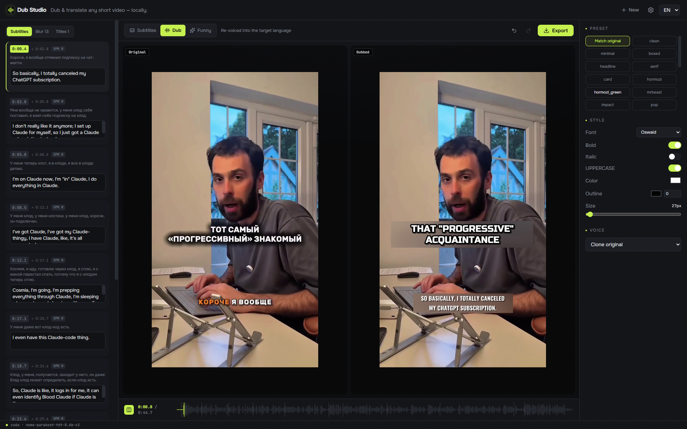

<div align="center">


# Dub Studio

**Опенсорсный CapCut для ИИ-дубляжа** — переозвучь любое короткое видео на 6 языков, **локально и бесплатно**, в живом редакторе.

[](https://github.com/timoncool/dub-studio/stargazers)
[](LICENSE)
[](https://github.com/timoncool/dub-studio/releases)


Умные авто-дефолты делают первый проход — дальше ты переопределяешь **каждый субтитр, голос, блюр-бокс, шрифт и тайтл** с мгновенным превью. Работает на твоей GPU. Без подписок и загрузок в облако.

<sub>**[Релизы](https://github.com/timoncool/dub-studio/releases)** · **[Упаковка](PACKAGING.md)** · дубляж на EN / RU / ZH / ES / PT / FR</sub>

**[English](README.md)** · **Русский**



</div>

---

> [!IMPORTANT]
> **Dub Studio — это бета, и она пока на 100% не идеальна.** Многое ещё требует доработки, и ты можешь
> повлиять на то, куда проект пойдёт дальше. Главное в планах: сделать **все модули сменными — ASR, LLM,
> vision, TTS** — чтобы можно было подключить любую модель и настроить весь пайплайн как угодно. Это большая
> работа, и мне нужна твоя помощь: issues, PR, тесты на реальных клипах и рецепты моделей — всё двигает проект.
> Если он полезен — поставь ⭐ и подключайся.

## Зачем

Облачные сервисы дубляжа (HeyGen, Rask, ElevenLabs) берут плату поминутно, загружают твоё видео и слепок
голоса на сервер и дают лишь поверхностное редактирование. Опенсорсные CLI-инструменты мощные, но уровня
Gradio — без перетаскиваемого холста и живого превью. **Dub Studio — это недостающая середина:** премиальный
редактор с живым превью, единственный, который ещё и **находит, заблюривает и перерисовывает экранный текст**,
полностью локально и бесплатно.

## Примеры

Русский оригинал (слева) → дубляж на английский нашим приложением (справа) — голос **и** текст на экране:

| Оригинал — RU | Дубляж на английский |
|:--:|:--:|
| https://github.com/timoncool/dub-studio/raw/master/docs/example_original.mp4 | https://github.com/timoncool/dub-studio/raw/master/docs/example_dub.mp4 |

## Возможности

| | |
|---|---|
| 🎙️ **Точный дубляж** | клон оригинального тембра, авто-кастинг по полу спикера или голос из пака — разный голос на каждого спикера |
| 🌍 **6 языков** | перевод речи *и* текста на экране; исходный язык определяется автоматически |
| 🅰️ **Текст на экране** | OCR → блюр оригинала → перерисовка локализованного текста в подобранном стиле (фишка, которой нет у других) |
| 🎬 **Живой редактор** | правка транскрипта, голосов, стиля субтитров, блюр-боксов, тайтлов — покадрово точное превью на каждом шаге |
| 🎛️ **Пресеты субтитров** | 26 готовых стилей (караоке / по слову / hormozi / неон / …), отрисованных на *твоём* кадре |
| 😂 **Шуточный ремикс** | задай тему («пираты», «как новостной репортаж») → модель переписывает весь сценарий → редаб |
| 🔁 **До / после** | оригинал ↔ дубляж бок о бок — проверка на доверие |
| 🧩 **Сменные модели** | слоты ASR / LLM / vision / TTS — подключай свои |

## Dub Studio против альтернатив

| | Dub Studio | OSS CLI-инструменты | HeyGen / Rask / ElevenLabs |
|---|:--:|:--:|:--:|
| Локально и приватно (без загрузки) | ✅ | ✅ | ❌ |
| Бесплатно | ✅ | ✅ | ❌ |
| Редактор с живым превью | ✅ | ❌ | ⚠️ поверхностный |
| Блюр + перерисовка экранного текста | ✅ | ❌ | ⚠️ редко, в облаке |
| Портативность (одна папка) | ✅ | ⚠️ | — |

## Быстрый старт (портатив, Windows)

1. Скачай свежий `DubStudio_*.zip` из [Релизов](https://github.com/timoncool/dub-studio/releases) и распакуй.
2. Запусти **`install.bat`** один раз — встраиваемый Python + CUDA-колёса под твою GPU + сборка UI.
3. Запусти **`run.bat`** → редактор откроется в браузере. Перетащи видео. Модели скачаются при первом запуске.

Цель — NVIDIA RTX 20xx–50xx (CUDA 12.8). Запуск из исходников:

```bash
cd dub-studio && pip install -e ../dub-engine -r requirements.txt -r requirements-engine.txt
# собрать UI один раз (бэкенд отдаёт его одним процессом):
cd frontend && npm i && npm run build && cd ..
set KMP_DUPLICATE_LIB_OK=TRUE
python -m uvicorn backend.app:app --port 8765   # открой http://127.0.0.1:8765
```

## Как это работает

`analyze()` — фиксированная первая стадия: разделение дорожек → ASR (тайминги слов) → диаризация →
контекст-перевод + vision (стиль субтитров / тайтлы / бренды) → OCR (раскладка / блюр-боксы). Возвращает
редактируемый документ **Project**. Каждая правка — патч этого Project с превью ~0.14 с на CPU; экспорт
перезапускает только «грязные» стадии. Движок — отдельный переиспользуемый пакет (**dub-engine**), вшит в портатив.

**Стек:** React 19 + Vite + Tailwind + react‑konva поверх JASSUB · одно-воркерный FastAPI · Parakeet
TDT (ASR) · Sortformer (диаризация) · Gemma‑4‑12B GGUF (перевод + vision) · Qwen3‑TTS · ffmpeg/NVENC.

## Помочь проекту

**Dub Studio — это бета, и я делаю её открыто; твоя помощь реально нужна.** Issues, PR, тесты на реальных
клипах и рецепты моделей — всё приветствуется; good‑first‑issues помечены, отвечаю в течение суток.

**В планах — отличные места, чтобы подключиться:**

- **Сменные модули** — сделать ASR / LLM / vision / TTS полностью подключаемыми, чтобы любой мог встроить
  свою модель и настроить весь пайплайн целиком. Это главное.
- Умнее локализация экранного текста — подбор цвета / контраста на сложных фонах.
- Больше голос-паков, пресетов субтитров и целевых языков.

Если что-то из этого твоё — заведи issue, помогу влиться.

## Лицензия

Приложение опенсорсное; вшитые модели сохраняют свои лицензии (проверяются перед каждым релизом).

---

## Другие портативные нейросети автора

| Проект | Что делает |
|---|---|
| [Foundation Music Lab](https://github.com/timoncool/Foundation-Music-Lab) | Генерация музыки + редактор таймлайна |
| [VibeVoice ASR](https://github.com/timoncool/VibeVoice_ASR_portable_ru) | Распознавание речи (ASR) |
| [LavaSR](https://github.com/timoncool/LavaSR_portable_ru) | Аудио супер-резолюшн |
| [Qwen3‑TTS](https://github.com/timoncool/Qwen3-TTS_portable_rus) | Синтез речи (Qwen) |
| [SuperCaption Qwen3‑VL](https://github.com/timoncool/SuperCaption_Qwen3-VL) | Описание изображений |
| [VideoSOS](https://github.com/timoncool/videosos) | AI-видеопродакшн в браузере |
| [RC Stable Audio Tools](https://github.com/timoncool/RC-stable-audio-tools-portable) | Генерация музыки и аудио |

## Авторы

- **Nerual Dreming** ([t.me/nerual_dreming](https://t.me/nerual_dreming)) — [neuro-cartel.com](https://neuro-cartel.com) · основатель [ArtGeneration.me](https://artgeneration.me)
- **Neuro‑Soft** ([t.me/neuroport](https://t.me/neuroport)) — портативные репаки нейросетей

---

> **Если проект полезен — поставь ⭐: это помогает другим его найти и двигает разработку.**

## Поддержать автора

Я создаю опенсорс-софт и занимаюсь исследованиями в области ИИ. Большая часть того, что я делаю, находится в открытом доступе. Ваши пожертвования позволяют мне создавать и исследовать больше, не отвлекаясь на поиск еды для продолжения существования =)

**[Все способы поддержки](DONATE.md)** | **[dalink.to/nerual_dreming](https://dalink.to/nerual_dreming)** | **[boosty.to/neuro_art](https://boosty.to/neuro_art)**

- **BTC:** `1E7dHL22RpyhJGVpcvKdbyZgksSYkYeEBC`
- **ETH (ERC20):** `0xb5db65adf478983186d4897ba92fe2c25c594a0c`
- **USDT (TRC20):** `TQST9Lp2TjK6FiVkn4fwfGUee7NmkxEE7C`

## Star History

<a href="https://www.star-history.com/?repos=timoncool%2Fdub-studio&type=date&legend=top-left">
 <picture>
   <source media="(prefers-color-scheme: dark)" srcset="https://api.star-history.com/image?repos=timoncool/dub-studio&type=date&theme=dark&legend=top-left" />
   <source media="(prefers-color-scheme: light)" srcset="https://api.star-history.com/image?repos=timoncool/dub-studio&type=date&legend=top-left" />
   
 </picture>
</a>
